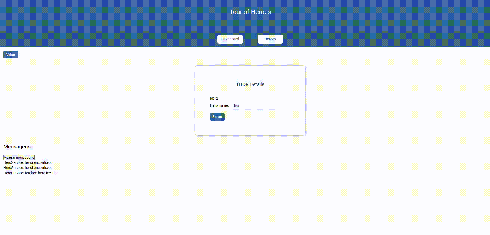

<h1> Heroes </h1>

> Status: Developer ☝️

### Objetivo 
#### Essa aplicação foi desenvolvida no intuito de aprender os conceitos básicos de Angular. Dentro dela o usuário poderá adicionar, pesquisar, remover, editar, navegar em telar e visualizar detalhes

 
  

### Sobre
<small> O Heroes, é uma aplicação desenvolvida em angular, baseado nos estudos da própria [**documentação**](https://angular.io/tutorial). O intuito dessa aplicação é estudar conceitos bases do Angular, como rotas, pesquisas, adição de icones, entendimento de estrutura e outras coisas.  

</small>

### Técnicas

- [x] Componentes
- [x] FormsModule
- [X] ngModel
- [X] Decorator
- [X] Services
- [X] RxJS
- [X] Routes
- [X] HTTP Services

## Rodar o Projeto

#### `yarn start`
Ao realizar o comando, internamente `ng serve` irá gerar o servidor. Navegue em `http://localhost:4200/`. 

 
  <small> Josileudo Rodrigues - 2021</small>
</div

